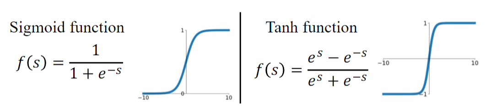
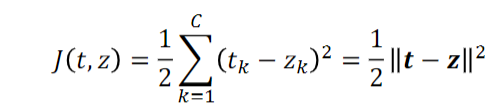

# Deep Learning Notes
[toc]
## Multi-layer Neural Networks
### Perceptron 感知器
- 输入信号(x1, x2, ...xm) -> 突触权值(w1, w2, ...Wm) -> bias(b) -> 激活函数φ() -> 输出 yi 
   
  
- the decision rule
  
- if example can be correctly classified 
  
- 分类错误会有损失，M是分错的集合。Objective function of Perceptron can be written as: 
  
- 用梯度下降来解决优化问题 Gradient descent to solve the optimization problem. 
  
- 局限性：由于激活函数使用的sign，导致感知器是线性函数，无法拟合非线性数据

### Multi-layer Neural Network (多层感知器，多层神经网络）
- 1986年 Geoffrey Hinton, David Rumelhart, and Ronald Williams提出反向传播(Backpropagation) 和 隐藏层(Hidden Layer)
  - 反向传播：通过不断修改参数减小预测值和真实值之间的差异。Backpropagation, a procedure to repeatedly adjust the  weights so as to minimize the difference between actual output and desired output
  - 隐藏层：通过在input和output层之间增加神经元，让模型可以学习复杂的非线性特征。Hidden Layers, which are neuron nodes stacked in between inputs and outputs, allowing neural networks to learn more complicated features (such as XOR logic) 
- 结构：输入层 / 隐藏层 / 输出层
  
- Feed Forward 正向传播
  
  - net: 线性回归的输出(未激活)
  - yj: net经过激活函数激活后称为y
  - 正向传播的过程就是线性传播的过程
### Expressive Power of a three-layer neural network

### Activation Functions 激活函数
- 激活函数需要满足的特点：
  - 非线性: Must be non-linaer, otherwise it is equivalent to a linear classifier.
    - e.g. y = ax+b, z = ky + c = kax + kb + c = (ka)x + (kb+c) failed
  - 连续函数，并在任意位置可导: Continuous and differentiable almost everywhere
  - 单调函数: Monotonicity, otherwise it introduces additional local extrema in the error surface
- Population choice of activation functions (single input)
  - Sigmoid function
    
    - f(s) = 1/(1+e^-s) = e^s/(e^s +1)
    - 本质上是吧输出的任意一个值映射到 0 和 1 之间
  - Tanh function: shift the center of Sigmoid to the origin
    
    - 把Sigmoid函数拉到原点
    - 把输出的值映射到 -1 和 1 之间
  - Rectified linear unit (ReLU) (往往表现最好)
    
  - Leaky ReLU（在S<0的时候，乘一个很小很小的值让S趋近于0）
    
    
  - 激活函数存在的问题
    - Vanishing gradient problems 梯度弥散
      
      - At their extremes, their derivatives are close to 0, which kills gradient and learning process  在极端情况下，他们的导数接近于0，破坏了梯度和学习过程
        
        
        
    - 解决方法：e.g. 正则化
  - Not zero centered activation 非原点对称
    
    - During training, all gradients will be all positive or all negative that will cause problem with learning.在训练过程中，所有的梯度将全部为正或全部为负，这将导致学习问题。
      
  - Dead ReLUs
    
    - For negative numbers, ReLU gives 0, which means some parts of neurons will not be activated and be dead.
    - 解决方法：Avoid large learning rate and wrong weight initialization, and try Leaky ReLU, etc.

### Backpropagation 反向传播

- Softmax Function
  - In multi-class classification, softmax function before the output layer is to assign conditional probabilities (given x) to each one of the K classes.
  
  - 相对于直接用net和output对比，经过softmax会让输出更加具有对比性
- Training Error
    - Euclidean distance
      
    - If both {tk} and  {zk} are probability distributions, we can use cross entropy 交叉熵
      
      - {tk}: true. {zk}: output.
      - logzk <  1 所以加 '-'
  - Cross entropy is asymmetric. In some cases we may use this symmetric form. 
    
- Cross Entropy Loss 交叉熵损失函
  
- 向后传播方式：链式法则+梯度下降
  - 链式法则
    - Hidden-to-output weight wkj 隐藏层到输出层 wkj
      
      
      
    - Input-to-hidden weight wji 输入层到隐藏层 wji
      
      
  - Gradient descent 梯度下降
    - Weights are initialized with random values, and then are updated in a direction reducing the error. 用随机值初始化权重，然后按照减小误差的方向更新权重。
      
    - where η is the learning rate. Iteratively update
      

- Stochastic Gradient Descent  (SGD) 随机梯度下降
  - One-example based SGD
    
    - epoch：对整个数据集的一次训练。
    - 在基于一个例子的训练中，权值的更新可以减少单个模式上的误差，但会增加整个训练集上的误差
  - Mini-batch based SGD
    - Principle
      - Divide the training set into mini-batches. 
      - In each epoch, randomly permute mini-batches and take a mini-batch sequentially to approximate the gradient
      - One epoch is usually defined to be one complete run through all of the training data.
    - The estimated gradient at each iteration is more reliable.
    - Algorithm
      
  - GD VS SGD VS Mini-batch based SGD
    
    - One-example based SGD 
      - Estimation of the gradient is noisy, and the weights may not move precisely down the gradient at each iteration 梯度的估计是有噪声的，权重可能不会在每次迭代时精确地向下移动梯度
      - Faster than batch learning, especially when training data has redundancy 比批量学习快，特别是当训练数据有冗余时
      - Noise often results in better solutions 噪音往往会带来更好的解决方案
      - The weights fluctuate and it may not fully converge to a local minimum 权重波动，可能不完全收敛到局部最小值
    - Min-batch based SGD
      - Conditions of convergence are well understood 很好理解收敛的条件
      - Some acceleration techniques only operate in batch learning 有些加速技术只适用于批量学习
      - Theoretical analysis of the weight dynamics and convergence rates are simpler 重量动力学和收敛速度的理论分析更简单
    - Summary
      - Mini-Batch SGD每一步更可靠
      - SGD比Mini-Batch SGD 收敛更快
